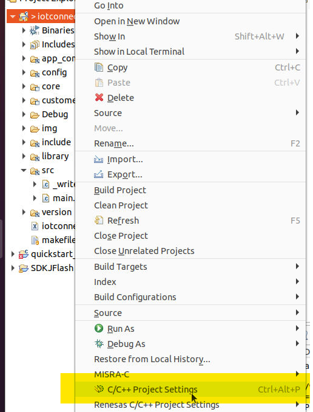
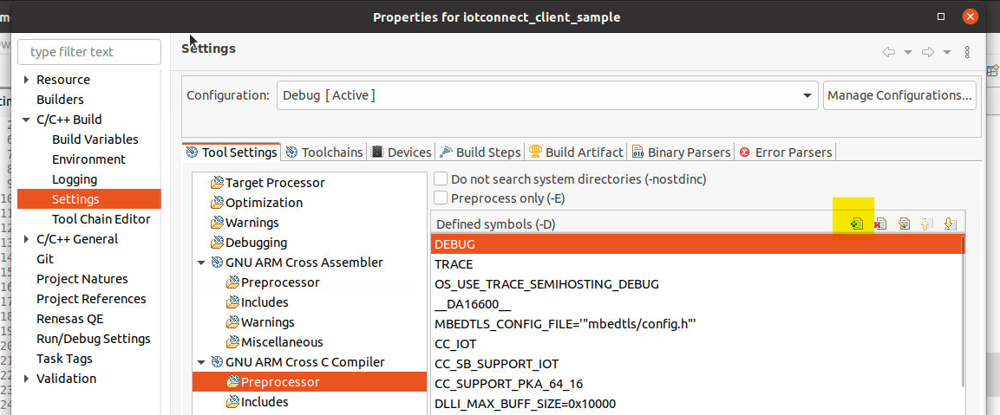
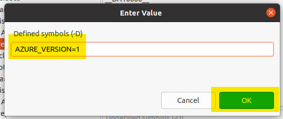

 

# DA16200 Developer's Guide

## Initial Setup

See [QUICKSTART](./QUICKSTART.md) for details on how to flash the images and setup IoTConnect.

## Setup For FreeRTOS development

Setup your development environment as per the Renesas
```
User Manual
DA16200 DA16600 FreeRTOS Getting Started Guide
UM-WI-056
```

Currently the document can be found linked at:
[Renesas DA16200 page](https://www.renesas.com/us/en/products/wireless-connectivity/wi-fi/low-power-wi-fi/da16200mod-devkt-da16200-ultra-low-power-wi-fi-modules-development-kit?gclid=EAIaIQobChMIxKyz4qHcgAMV1oFQBh3eWQsQEAAYASAAEgLqnvD_BwE#document)
or
[Renesas DA16600 page](https://www.renesas.com/eu/en/products/wireless-connectivity/wi-fi/low-power-wi-fi/da16600mod-devkt-da16600-ultra-low-power-wi-fi-bluetooth-low-energy-modules-development-kit#document).

Recommended to setup so can build and flash the DA16200 – at least using YModem protocol, i.e. using `loady` commands. Need to run easy WiFi `setup` to associate a WiFi access point (SSID, password, etc.). Should also set SNTP to start automatically on boot. Check that the board is configured correctly and that can build at least one example application, e.g. apps/common/examples/Network/Http_Client using projects/da16200 (or projects/da16600).

Note: DA16600 has two different flash configurations, whereas DA16200 only has a single flash configuration.

Issue: It should be possible to easily use binaries between different boards using DA16200 - may have to generate two sets of binaries to cover all DA16600 boards.

## Setup for IoTConnect development

Warning: the IoTConnect application is based on the FreeRTOS SDK version 3.2.8.1 at the time of writing (using e² studio).

Other versions may work, but cannot be guaranteed.

The IoTConnect example application and modifications to the FreeRTOS package can be accessed at [IoTConnect dialog github](https://github.com/avnet-iotconnect/iotc-dialog-da16k-sdk).

Clone the git repo and then use the downloaded files to overwrite their counterparts / add files to the original Renesas FreeRTOS package – may need to take account of different directory levels to do so.

## Compiling the IoTConnect application

The IoTConnect application is at apps/common/examples/Network/IoTConnect_Client.

### Building for AWS or Azure

The application supports both Azure and AWS 2.1 at this time.

It compiles for AWS by default.

To build it for Azure, the `AZURE_VERSION` preprocessor define must be added to the project.

To do this, right click the project in e² studio and select *C/C++ Project Settings*.



Then, under *GNU ARM Cross C Compiler*, go to *Preprocessor* and add a new definition.



Enter `AZURE_VERSION=1`, click *OK*, and then *Apply and Close*.



Rebuild the application as normal.

### DA16200

A DA16200 based project should use `projects/da16200` to compile the application.

Once the binaries are compiled they should be in: `projects/da16200/img`.

### DA16600

A DA16600 based project should use `projects/da16600` to compile the application.

Once the binaries are compiled they should be in: `projects/da16600/img`.

## Flashing the IoTConnect application

See [QUICKSTART](./QUICKSTART.md) for details on how to flash the images and setup IoTConnect.

