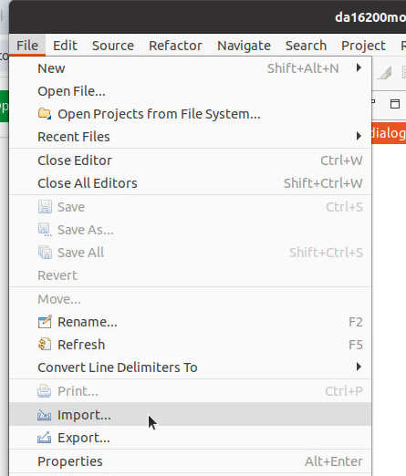
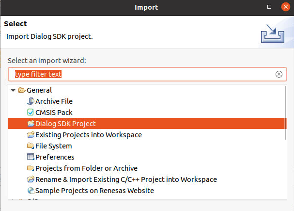
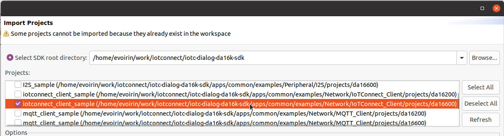
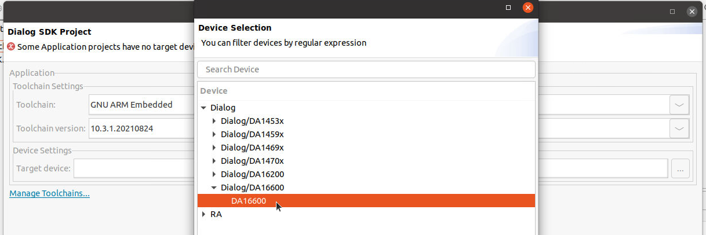
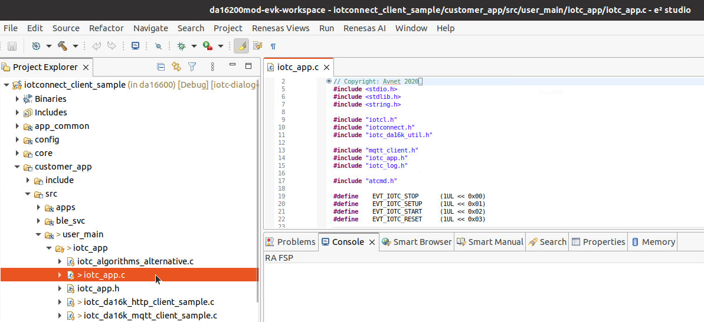
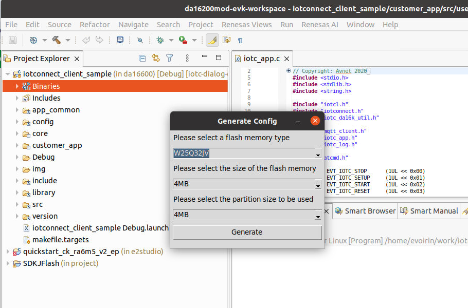
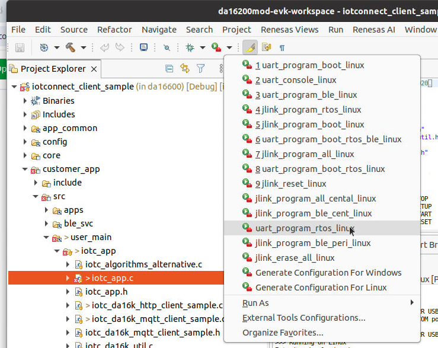
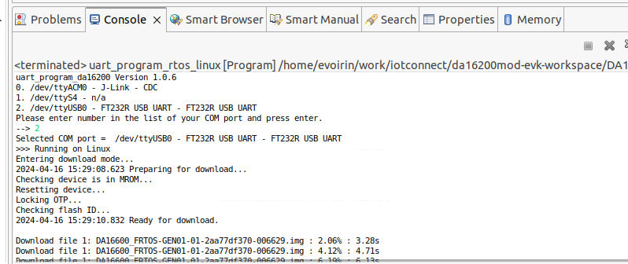

# DA16200 Developer's Guide

## Setup for IoTConnect development

The IoTConnect application is based on the DA16200/DA16600 FreeRTOS SDK version 3.2.8.1 
so you must use that specific version in the next steps.

* Clone this git repository into an arbitrary directory.
* Download and unzip the Renesas Dialog [DA16200_DA16600_SDK_FreeRTOS_v3.2.8.1.zip, available here](https://www.renesas.com/us/en/document/sws/da16200-da16600-freertos-sdk-v3281?language=en&r=1600096) 
to [DA16K_SDK_FreeRTOS](/DA16K_SDK_FreeRTOS) subdirectory of this repo in a way that the ```apps```, ```core`` 
and other SDK directories appear here at the root of this directory.
* ***Run the setup script:*** `./scripts/setup-project.sh`

## Development Environment Setup

Currently, the Renesas DA16200/DA16600 FreeRTOS SDK and documentation can be found linked at:
[Renesas DA16200 page](https://www.renesas.com/us/en/products/wireless-connectivity/wi-fi/low-power-wi-fi/da16200mod-devkt-da16200-ultra-low-power-wi-fi-modules-development-kit?gclid=EAIaIQobChMIxKyz4qHcgAMV1oFQBh3eWQsQEAAYASAAEgLqnvD_BwE#document)
or
[Renesas DA16600 page](https://www.renesas.com/eu/en/products/wireless-connectivity/wi-fi/low-power-wi-fi/da16600mod-devkt-da16600-ultra-low-power-wi-fi-bluetooth-low-energy-modules-development-kit#document).

* Set up your development environment as per Renesas Dialog SDK **UM-WI-056 DA16200 DA16600 FreeRTOS Getting Started Guide**,
but mind the following notes and exceptions:
  * When creating the workspace, chose an arbitrary location that is not in this repo.
  * When importing the project, point the import to the root of this Git repository and not the extracted location of the
      Dialog's DA16200/DA16600 FreeRTOS SDK.
  * In the chapter **`5.4 Importing DA16200 FreeRTOS SDK Project into e² studio`** is easy to overlook, 
      you can optionally choose to import installing the default Renesas application to test the board
      to get familiar with the development process.
      You will however ultimately need import and run [The IoTConnect Application](#compiling-the-iotconnect-application) section
      instead of importing the default project.
  * Determining the flash type for your board may be a bit confusing. 
      The boards that we have tested all came with W25Q32JW flash, which corresponds to the following
      bootloader output:
```
[/DA16200] # reset
	*********************************************
	*      FCI   FC9K MaskROM BootLoader
	*  Cortex-M4 (XTAL 40000 KHz, SYS 120000 KHz)
   (etc) ... 
[MROM] sflash info
SFLASH:ef601615
Density:01ffffff
```
| Board       | Flash type         |
|-------------|--------------------|
| DA16200PMOD | W25Q32JW (Winbond) |
| DA16600PMOD | AT25SL321 (Adesto) |


## Compiling The IoTConnect Application

The IoTConnect application is at `apps/common/example/Network/IoTConnect_Client`.

Import the project as follows:

* Select `File`, `Import` in the main screen of your workspace.

    

* Select `Dialog SDK Project`

    

* Select the repository directory as the `SDK root directory`.

    Seroll down to find the IoTConnect application project for your target processor (DA16200 or DA16600) and select it.

    

* Select the target device.

    

* The project is now added to the workspace, and you can start developing and building.

    

### Selecting the flash configuration

On your first build, you will be asked to configure the project for the 

The flash chip option is dependent on the specific device you are targeting, so you must consult the datasheet / technical manual / schematics of the device.

The displayed example works for the DA16600PMOD dongle.



## Flashing images using `uart_program_da16200`

**Note: Make sure the serial port is not being used by other terminal software.**

### Using e² studio

As the `5.4 Importing DA16200 FreeRTOS SDK Project into e² studio` chapter adds the necessary flash tools to the IDE, you can use it to flash the built firmware from it:



The tool will ask you for the appropriate serial port device and then start the flashing process.



### Manual

Please refer to the Renesas guide *User Manual DA16200 DA16600 FreeRTOS Getting Started Guide UM-WI-056* in case there are changes in the future - in version 8, see section 4.5 (*Programming Firmware Images*).

For example, after building IoTConnect_client, copy appropriate Linux or Windows version of uart_program_da16200 to apps/common/examples/Network/IoTConnect_Client/projects/da16200/img and then (in Linux)

```
cd apps/common/examples/Network/IoTConnect_Client/projects/da16200/img
./uart_program_da16200 -i 0 DA16200_FBOOT-GEN01-01-c7f4c6cc22_W25Q32JW.img
./uart_program_da16200 -i 23000 DA16200_FRTOS-GEN01-01-f017bfdf51-006558.img
./uart_program_da16200
```

Note: the uart_program_da16200 is part of the DA16200_DA16600_SDK_FreeRTOS_v3.2.8.0.zip in:
- utility/j-link/scripts/qspi/linux/uart_program_da16200
- utility/j-link/scripts/qspi/win/uart_program_da16200.exe

## Setting up the IoTConnect application

See [QUICKSTART](./QUICKSTART.md) for details on how to flash the images and setup IoTConnect.

