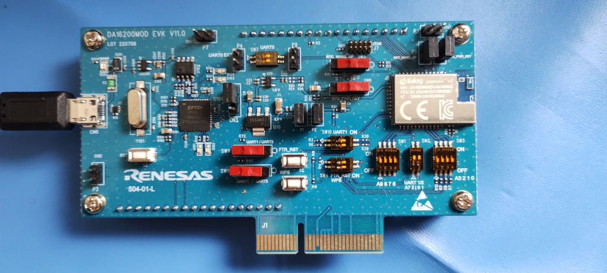
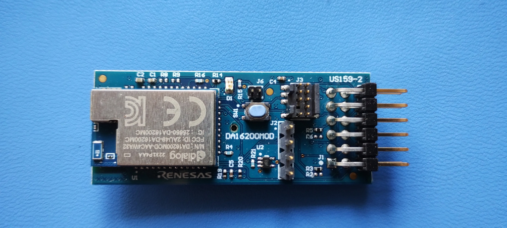
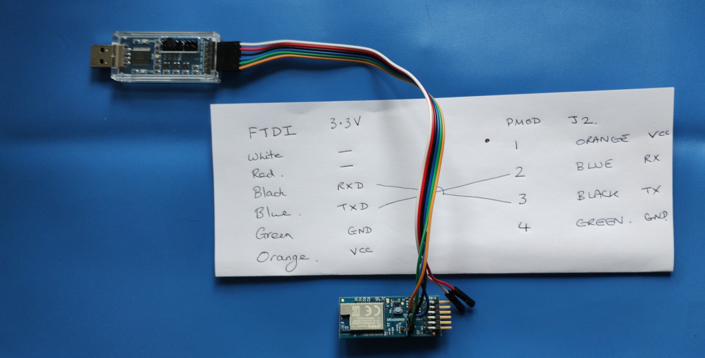
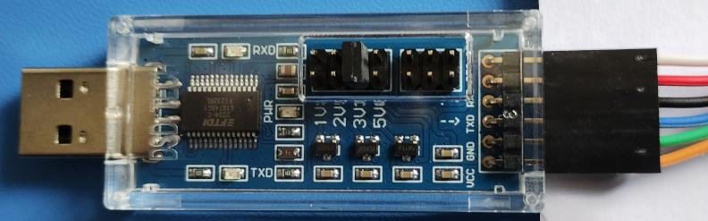
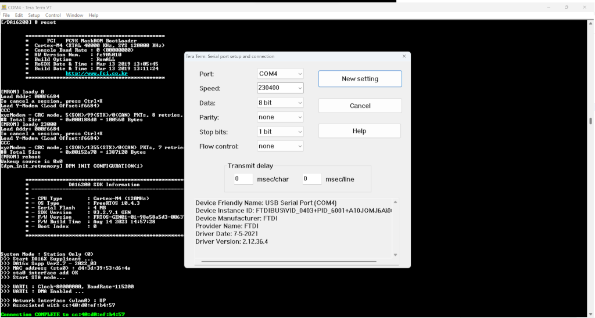
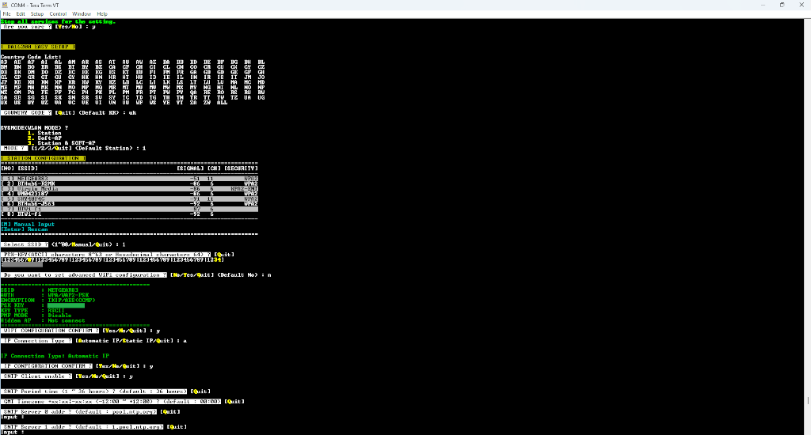
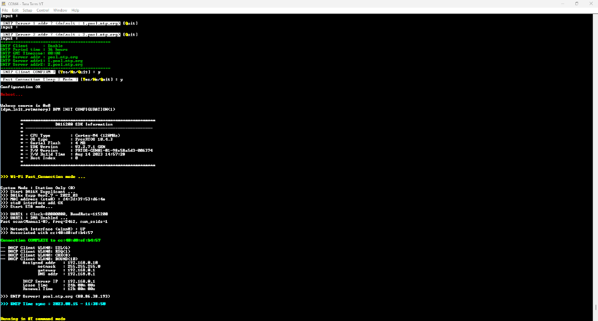
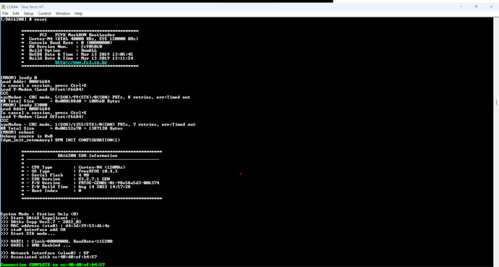

# DA16200 Quickstart Guide

This document and the information it contains is CONFIDENTIAL and remains the property of our company. It may not be copied or communicated to a third party or used for any purpose other than that for which it is supplied without the prior written consent of our company. This document must be destroyed with a paper shredder.

## Boards
#Using DA16200MOD EVK

Connect USB lead to board and PC.


### Using DA16200MOD


Connect to FTDI as follows


PMOD connections


FTDI connections


Note RX/TX are crossed, TX on FTDI goes to RX on PMOD and RX on FTDI goes to TX on PMOD.
FTDI is set to 3.3v

## Connect DA16200


Note: on the DA16200 dev kit, there are two consoles, a “command console” on the lower port (at 230400 baud) and an “AT console” on the higher port (at 115200 baud).
Note: on the PMOD DA16200 board there is only one console, the “command console” at 230400 baud.

Please refer to the Renesas guide “User Manual, DA16200 DA16600 FreeRTOS Getting Started Guide, UM-WI-056” to check that the configuration shown above is valid - in case there are changes in the future.
Setup DA16200

## Setup your DA16200 as per the Renesas document
```
User Manual
DA16200 DA16600 FreeRTOS Getting Started Guide
UM-WI-056
```
Currently the document can be found linked at:
[Renesas DA16200 page](https://www.renesas.com/us/en/products/wireless-connectivity/wi-fi/low-power-wi-fi/da16200mod-devkt-da16200-ultra-low-power-wi-fi-modules-development-kit?gclid=EAIaIQobChMIxKyz4qHcgAMV1oFQBh3eWQsQEAAYASAAEgLqnvD_BwE#document)
or
[Renesas DA16600 page](https://www.renesas.com/eu/en/products/wireless-connectivity/wi-fi/low-power-wi-fi/da16600mod-devkt-da16600-ultra-low-power-wi-fi-bluetooth-low-energy-modules-development-kit#document).

At the command prompt `[/DA16200] #` type `setup` to:
-    associate a WiFi access point (SSID, password, etc.)
-   set SNTP to start automatically on boot. 

This setup process will write values to NVRAM that will be used when the DA16200 reboots.

The following images show an example of how to configure the DA16200.




## Flashing DA16200 images

To flash DA16200 images use TeraTerm YModem transfer protocol (or similar) to send the images to the DA16200 using the “command console”, e.g.


Note: moving TeraTerm Ymodem window can adversely affect any transfer – so best not to move windows around while sending data.

Please refer to the Renesas guide “User Manual, DA16200 DA16600 FreeRTOS Getting Started Guide, UM-WI-056” to check that the commands shown above are valid - in case there are changes in the future.

The smaller image, e.g. DA16200_FBOOT-GEN01-01-922f1e27d_W25Q32JW.img is flashed using loady 0

The larger image, e.g. DA16200_FRTOS-GEN01-01-98e58a5d3-006374.img is flashed using loady 23000

Run boot_idx 0 (refer to Section 4.5.4 in User Manual mentioned above)
```
reboot
```
### Images for DA16200

See:[DA16200 images](./image/release-da16200-images-332b6a40bac5213ee79c4c991b9af3e2bbd1a41c.tgz).

## Setting up IoTConnect

### Setup X509 keys (for IoTConnect and Azure)

At the command prompt, type net to get access to the network based commands (need to type up to get back to “normal” command prompt).

Need to set the X509 certificates for IoTConnect discovery/sync and Azure MQTT, e.g.
```
[/DA16200/NET] # cert status

#1:
  For MQTT, CoAPs Client
  - Root CA     : Empty
  - Certificate : Empty
  - Private Key : Empty
  - DH Parameter: Empty

#2:
  For HTTPs, OTA
  - Root CA     : Empty
  - Certificate : Empty
  - Private Key : Empty
  - DH Parameter: Empty

#3:
  For Enterprise (802.1x)
  - Root CA     : Empty
  - Certificate : Empty
  - Private Key : Empty
  - DH Parameter: Empty

TLS_CERT for ATCMD
  - TLS_CERT_01 : Empty
  - TLS_CERT_02 : Empty
  - TLS_CERT_03 : Empty
  - TLS_CERT_04 : Empty
  - TLS_CERT_05 : Empty
  - TLS_CERT_06 : Empty
  - TLS_CERT_07 : Empty
  - TLS_CERT_08 : Empty
  - TLS_CERT_09 : Empty
  - TLS_CERT_10 : Empty
```

Pick an appropriate X509 certificate for the Azure MQTT broker, e.g. Need to copy/paste (with CR) and then type “control-C”.

```
[/DA16200/NET] # cert write ca1
Typing data: (Certificate value)
        Cancel - CTRL+D, End of Input - CTRL+C or CTRL+Z
-----BEGIN CERTIFICATE-----
...
-----END CERTIFICATE-----

ca1 Write success.
```
Note Azure X509 certificates are in process of changing, so may need to use a different certificate for the Root of Trust in the future.

It is unclear whether DA16200 is able to process multiple possible certificates for a Root CA – all testing has used a single certificate. Obviously, if a certificate doesn’t allow a connection, then may need to “manually” swap to an alternative certificate.

Pick an appropriate X509 certificate for the IoTConnect HTTP discovery/sync, e.g. Need to copy/paste (with CR) and then type “control-C”.
```
[/DA16200/NET] # cert write ca2
Typing data: (Certificate value)
        Cancel - CTRL+D, End of Input - CTRL+C or CTRL+Z
-----BEGIN CERTIFICATE-----
...
-----END CERTIFICATE-----

ca2 Write success.
```

Now we can see that the certificates are written, i.e. MQTT and HTTP Root CA certificates are now found.

```
[/DA16200/NET] # cert status

#1:
  For MQTT, CoAPs Client
  - Root CA     : Found
  - Certificate : Empty
  - Private Key : Empty
  - DH Parameter: Empty

#2:
  For HTTPs, OTA
  - Root CA     : Found
  - Certificate : Empty
  - Private Key : Empty
  - DH Parameter: Empty

#3:
  For Enterprise (802.1x)
  - Root CA     : Empty
  - Certificate : Empty
  - Private Key : Empty
  - DH Parameter: Empty

TLS_CERT for ATCMD
  - TLS_CERT_01 : Empty
  - TLS_CERT_02 : Empty
  - TLS_CERT_03 : Empty
  - TLS_CERT_04 : Empty
  - TLS_CERT_05 : Empty
  - TLS_CERT_06 : Empty
  - TLS_CERT_07 : Empty
  - TLS_CERT_08 : Empty
  - TLS_CERT_09 : Empty
  - TLS_CERT_10 : Empty

[/DA16200/NET] #
```

## Command line

To “drive” the PMOD when there is only one terminal available, the “net” command-line is updated to include “iotconnect_config” and “iotconnect_client”.

At the command prompt, type net to get access to the network based commands (need to type up to get back to “normal” command prompt).

### iotconnect_config

The
```
iotconnect_config 
```
command will print the values of the IOTC nvram values.

Also
```
iotconnect_config option value
```
will set iotconnect 
- env
- cpid
- duid
- symmetric_key
- auth_type
- use_cmd_ack
- use_ota_ack 
options to the specified value (note unlike the AT command a symmetric key value with “=” can be set directly).

```
[/DA16200/NET] # iotconnect_config

- iotconnect_config

Usage : iotconnect_config [reset|env|cpid|duid|symmetric_key|auth_type|use_cmd_ack|use_ota_ack] [value]
    env:
    cpid:
    duid:
    symmetric_key:
    auth_type:
    use cmd ack:
    use OTA ack:
    DTG (get) :
```

#### env
Use value from IoTConnect Dashboard - Key Vault.

#### cpid
Use value from IoTConnect Dashboard - Key Vault.

#### duid
This is the device name as specified on IoTConnect dashboard.

#### auth_type

auth_type is an numeric value representing the authentication type.

##### Token = 1
	
##### X509 = 2
	
Use “cert write cert1” and “cert write key1” to save the device MQTT cert and private key in NVRAM.

##### Self-signed (X509) = 2
	
May change to 3 in the near future, for consistency.
	

Use “cert write cert1” and “cert write key1” to save the device MQTT cert and private key in NVRAM.

##### TPM = 4

Not supported.
	
##### Symmetric key = 5

#### symmetric_key
Only required if auth_type is 5.

Use “iotconnect_config symmetric_key string” to set the base64 encoded device symmetric key to “string”.

#### use_cmd_ack
By default commands will fail automatically, i.e. the acknowledgement is handled implicitly.

To handle the command acknowledgement explicitly set use_cmd_ack to 1.
To revert to implicit command acknowledgement set use_cmd_ack to 0.

#### use_ota_ack
By default OTA update will fail automatically, i.e. the acknowledgement is handled implicitly.

To handle the OTA update acknowledgement explicitly set use_ota_ack to 1.
To revert to implicit OTA acknowledgement set use_ota_ack to 0.

### iotconnect_client

#### Setup - read IOTC values from NVRAM

To setup IoTConnect values. run
```
iotconnect_client setup
```

#### Start (Discovery/Sync & MQTT Setup)

To run IoTConnect discovery/sync and update MQTT values and start mqtt_client, run
```
iotconnect_client start
```
Check that the device is shown as connected on the IoTConnect dashboard.

Note: must have been setup before starting.

#### Stop

To disconnect from IoTConnect but leave the runtime configuration intact
```
iotconnect_client stop
```
Check that the device is shown as disconnected on the IoTConnect dashboard.

Note: after a stop don’t have have to perform a setup, before a start - the previously determined values will then be re-used.

#### Reset

To disconnect from IoTConnect and reset the runtime configuration
```
iotconnect_client reset
```
Check that the device is shown as disconnected on the IoTConnect dashboard.

Note: after a reset must perform a setup, before a start - all values will then be determined afresh.

#### Message

To send an IotConnect message, run
```
iotconnect_client msg name value name2 value2
```
for up to 7 name/value pairs.

Check that the device is shown as connected and that the message data can be seen.

#### Command

A C2D command failure can be acknowledged using
```
iotconnect_client cmd_ack type ack_id 0 message
```
A C2D command success can be acknowledged using
```
iotconnect_client cmd_ack type ack_id 1 message
```
Note type and ack_id are printed on the terminal when the command request is received.

#### OTA

A C2D OTA failure can be acknowledged using
```
iotconnect_client ota_ack ack_id 0 message
```
A C2D OTA success can be acknowledged using
```
iotconnect_client ota_ack ack_id 1 message
```
Note ack_id is printed on the terminal when the OTA request is received.

## Using AT Commands

The use of AT commands is beyond this Quickstart guide, see: H0037 - 47 - A - Renesas DA16200 "AT" command set

 
