# DA16x00 PMOD QuickStart Guide
## Introduction

The **Dialog DA16200** and **DA16600** are ultra-low-power Wi-Fi SoCs designed to enable reliable and long-lasting connectivity for battery-powered IoT devices. Both SoCs are optimized for IoT applications, with the **DA16200** providing single-band Wi-Fi connectivity and the **DA16600** integrating both Wi-Fi and Bluetooth Low Energy (BLE) for dual-connectivity use cases. These features make the DA16x00 family ideal for applications like smart home devices, healthcare monitors, industrial IoT, and asset tracking.

This quickstart guide demonstrates how to integrate the DA16200 and DA16600 modules with **/IOTCONNECT**, Avnet’s robust IoT platform. /IOTCONNECT simplifies cloud integration by providing features such as secure device onboarding, real-time telemetry, advanced data visualization, and over-the-air (OTA) updates.

## Requirements

* A computer running an actively supported version of Windows (10 / 11)
* A supported DA16x00 PMOD or EVK.
* A terminal program, such as TeraTerm or HyperTerminal.
* A USB-to-Serial converter or FTDI SERIAL TTL-232 USB cable.
* Renesas DA16200 DA16600 Multi Downloader Tool
    - Can be obtained at the [Renesas DA16200 Product Page](https://www.renesas.com/us/en/products/wireless-connectivity/wi-fi/low-power-wi-fi/da16200-ultra-low-power-wi-fi-soc-battery-powered-iot-devices#design_development)

        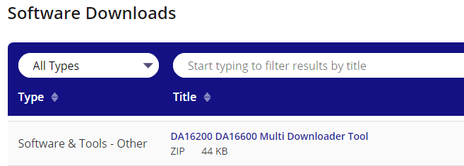

## DA16x00 Hardware
### DA16x00 hardware interfaces

The DA16x00 hardware platforms used here broadly speaking provide two usable serial ports for this project:

* The **programming/debug serial interface**
    * Runs at 230400 baud rate.(Receive:LF; Transmit:LF; No flow control)
    * Used to configure the device and flash the firmware.
* The **AT command serial interface**
    * Runs at 115200 baud rate.
    * This is the serial interface that will be used by the embedded client to send data to the DA16x00 for transmission to /IOTCONNECT.

### Supported Boards

The SDK is intended for and tested with the following platforms:

* PMOD Dongles
    * DA16200MOD
    * DA16600MOD

* EVK Boards
    * DA16200MOD EVK
    * DA16600MOD EVK

### Programming/Debug interface wire connection
<details>
<summary><b>*Programming/Debug interface wire connection*</b></summary>
<br>

You will be guided through the setup process below. Please refer to the Renesas guide 
[DA16200 DA16600 FreeRTOS Getting Started Guide](https://www.renesas.com/en/document/qsg/um-wi-056-da16200-da16600-freertos-getting-started-guide) 
in case there are changes in the future.

### DA16200MOD / DA16600MOD PMOD Dongle

|16200MOD|16600MOD|
|-|-|
| 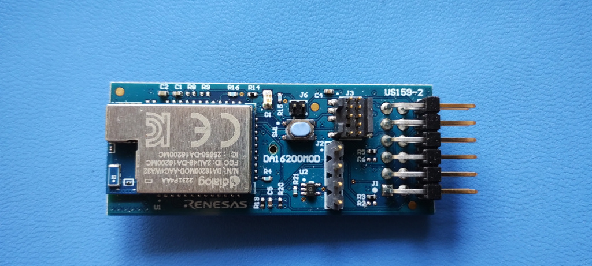 | 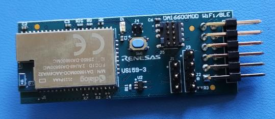 |

#### FTDI connection

Connect the PMOD dongle to the FTDI dongle as follows:

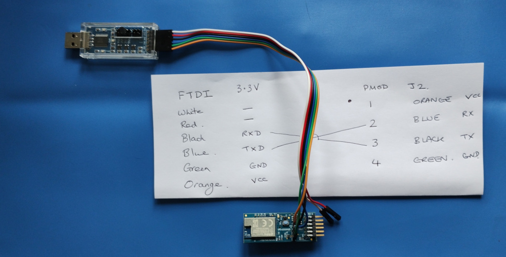

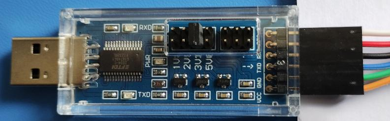

|16200MOD|16600MOD|
|-|-|
| 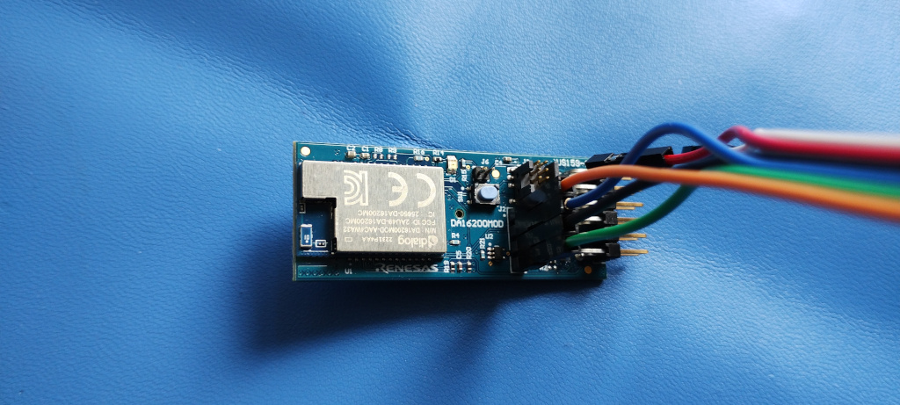 | 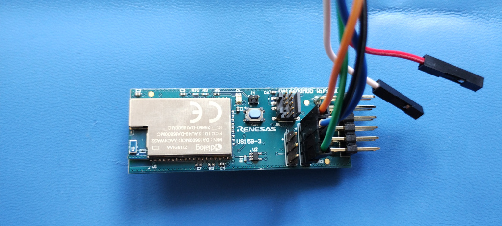 |

Note: RX/TX need to be crossed when connecting them, i.e.:

* The USB-Serial dongle's TX line goes to RX on the PMOD.
* The USB-Serial dongle's RX goes to TX on the PMOD.

### DA16200MOD / DA16600MOD EVK

|16200MOD EVK|16600MOD EVK|
|-|-|
| 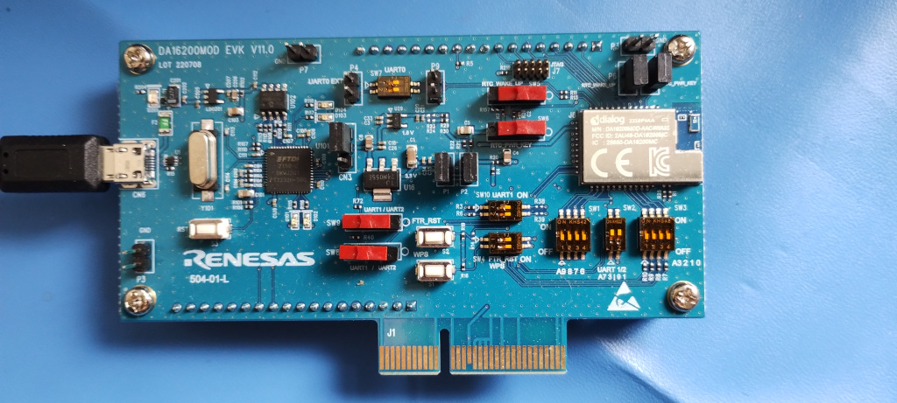 | 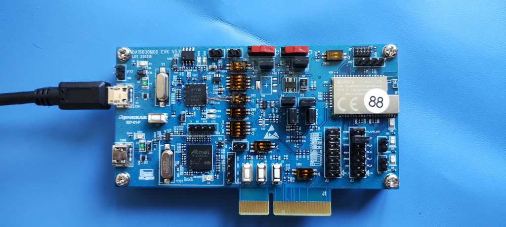 |

The EVK boards provide the serial connections using the debug interface.

</details>

## Flashing the /IOTCONNECT DA16x00 Image via the programming/debug interface

You can either build it yourself (see the [Developers Guide](DEVELOPER_GUIDE.md)) or use the pre-built firmware images in the `/images/` directory at the root of the repository.

This assumes that the device has an intact *BOOT* partition, as it would have from the factory or if another working firmware image was deployed before.

In the unlikely event that your device does *not* have an intact *BOOT* partition, follow the [Developers Guide](DEVELOPER_GUIDE.md) to build and flash one.

To flash the /IOTCONNECT firmware, follow these steps:

* Extract and launch the downloaded Multi Download Tool.
* Click the `Settings` Button.

    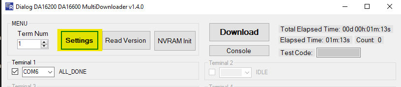

* **In the `Settings` Window:**
    * Click the check-box next to `RTOS1`

    * Add the firmware image by double-clicking the grey field to the right of `RTOS1` and navigating to it.

    * Set the destination address to `23000`

    * The window should now look similar to the following graphic:
    
        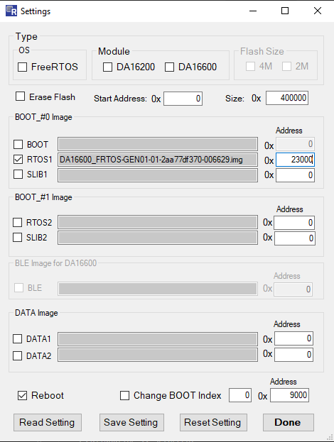

* Close the `Settings` window.

* Select the COM port corresponding to the programming/debug interface (you may have to experiment to find it) and click **Download**.

    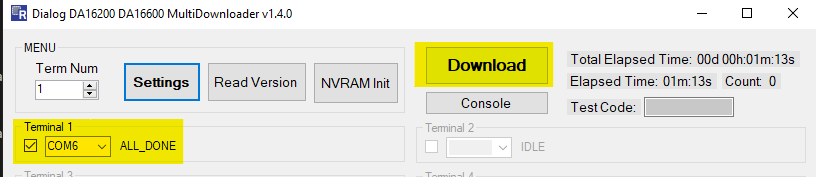

* The image will now be downloaded on the device.

    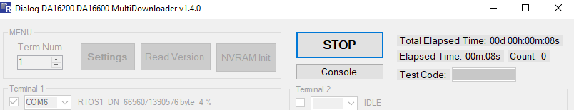

* Once the image is finished, a message indicating the success (or failure) will be displayed.

    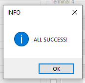

## DA16x00 Configuration via the programming/debug interface

The following is a rough summary of the steps to be taken.

* Connect to the programming/debug interface (the same COM port used for flashing the firmware) using a serial terminal program of your choice.

* You should see a command prompt by hitting "ENTER" on the keyboard:

<pre><samp>[/DA16200] #</samp></pre>

* Type <kbd>setup</kbd> to:
    - Associate a WiFi access point (SSID, password, etc.)

    - Enable and configure SNTP to start automatically on boot.

    - This setup process will write values to NVRAM that will be used when the DA16200 reboots.

    - The firmware might ask you if you wish to configure DPM.
    
        **At this point in time, DPM modes are unsupported.**

        Therefore, you *must* answer this question with <kbd>No</kbd>

* The following is an example log of this configuration process:

<pre><samp>
    Wakeup source is 0x0
    [dpm_init_retmemory] DPM INIT CONFIGURATION(1)
    
            ******************************************************
            *             DA16200 SDK Information
            * ---------------------------------------------------
            *
            * - CPU Type        : Cortex-M4 (120MHz)
            (...)
            *
            ******************************************************

    (...)

    [/DA16200] # setup

    Stop all services for the setting.
     Are you sure ? [Yes/No] : y

    [ DA16200 EASY SETUP ]

    Country Code List:
    AD  AE  AF  AI  AL  AM  AR  AS  AT  AU  AW  AZ  BA  BB  BD  BE  BF  BG  BH  BL
    (...)
    UK  US  UY  UZ  VA  VC  VE  VI  VN  VU  WF  WS  YE  YT  ZA  ZW  ALL

     COUNTRY CODE ? [Quit] (Default KR) : DE

    SYSMODE(WLAN MODE) ?
            1. Station
            2. Soft-AP
            3. Station & SOFT-AP
     MODE ?  [1/2/3/Quit] (Default Station) : 1

    [ STATION CONFIGURATION ]
    ============================================================================
    [NO] [SSID]                                         [SIGNAL] [CH] [SECURITY]
    ----------------------------------------------------------------------------
    [ 1] AVNET_TEST                                         -51   1         WPA2
    (...)
    ----------------------------------------------------------------------------
    [M] Manual Input
    [Enter] Rescan
    ============================================================================

     Select SSID ? (1~14/Manual/Quit) : 1

     PSK-KEY(ASCII characters 8~63 or Hexadecimal characters 64) ? [Quit]
    [123456789|123456789|123456789|123456789|123456789|123456789|1234]
    :***********

     Do you want to set advanced WiFi configuration ? [No/Yes/Quit] (Default No) : n

    ============================================
    SSID        : AVNET_TEST
    AUTH        : WPA/WAP2-PSK
    ENCRYPTION  : TKIP/AES(CCMP)
    PSK KEY     : ***********
    KEY TYPE    : ASCII
    PMF MODE    : Disable
    Hidden AP   : Not connect
    ============================================
     WIFI CONFIGURATION CONFIRM ? [Yes/No/Quit] : y

     IP Connection Type ? [Automatic IP/Static IP/Quit] : a

    IP Connection Type: Automatic IP

     IP CONFIGURATION CONFIRM ? [Yes/No/Quit] : y

     SNTP Client enable ? [Yes/No/Quit] : y

     SNTP Period time (1 ~ 36 hours) ? (default : 36 hours) [Quit]

     GMT Timezone +xx:xx|-xx:xx (-12:00 ~ +12:00) ? (default : 00:00) [Quit]

     SNTP Server 0 addr ? (default : pool.ntp.org) [Quit]
     SNTP Server 1 addr ? (default : 1.pool.ntp.org) [Quit]
     SNTP Server 2 addr ? (default : 2.pool.ntp.org) [Quit]
  
    ============================================
    SNTP Client      : Enable
    SNTP Period time : 36 hours
    SNTP GMT Timezone: 00:00
    SNTP Server addr : pool.ntp.org
    SNTP Server addr1: 1.pool.ntp.org
    SNTP Server addr2: 2.pool.ntp.org
    ============================================
     SNTP Client CONFIRM ? [Yes/No/Quit] : y

     Fast Connection Sleep 2 Mode ? [Yes/No/Quit] : y

    Configuration OK

    Reboot...


    Wakeup source is 0x0
    [dpm_init_retmemory] DPM INIT CONFIGURATION(1)


            ******************************************************
            *             DA16200 SDK Information
            * ---------------------------------------------------
            *
            * - CPU Type        : Cortex-M4 (120MHz)
            (...)
            *
            ******************************************************


    >>> Wi-Fi Fast_Connection mode ...


    System Mode : Station Only (0)
    >>> Start DA16X Supplicant ...
    >>> DA16x Supp Ver2.7 - 2022_03
    (...)
    -- DHCP Client WLAN0: BOUND(10)
             Assigned addr   : 192.168.0.12
                   netmask   : 255.255.255.0
                   gateway   : 192.168.0.1
                   DNS addr  : 192.168.0.1

             DHCP Server IP  : 192.168.0.1
             Lease Time      : 24h 00m 00s
             Renewal Time    : 12h 00m 00s
</samp></pre>

> [!NOTE]
> 1. SNTP sync may fail occasionally, and you can type "reboot" on the terminal to restart the application/board.
> 2. Ensure that the terminal's serial port setup is baud rate 230400, Receive:LF and Transmit: LF.
> 3. ***[/DA16200/NVRAM]clearenv*** This command can erase all the settings in NVRAM and you can re-write settings again.

## Setting up /IOTCONNECT

### Configuring Certificates & /IOTCONNECT Application Config

Refer to the [Application Setup Guide](SETUP_APP.md).

> [!NOTE]
>
> Ensure that you use the correct "device certificate", "device key", "cpid", "env", "duid(did)" when setting up the
> /IOTCONNECT configuration. They can be obtained on /IOTCONNECT webpage after successfully creating the IoT device. 

## Running iotconnect_client

### Setup - read IOTC values from NVRAM

Ensure all certificates are in place, and that iotconnect_config has been used to save the configuration -- before initiating `iotconnect_client setup`.

If the configuration stage is missed, then there will be no valid values to setup.

To setup /IOTCONNECT values, run:
```
iotconnect_client setup
```

### Start (Discovery/Sync & MQTT Setup)

Ensure that all certificates are in place, that iotconnect_config has been used to save the configuration, and that "iotconnect_client setup" has been run, and the device has been successfully created on /IOTCONNECT.-- before initiating "iotconnect_client start".

To run /IOTCONNECT discovery/sync and update MQTT values and start mqtt_client, run
```
iotconnect_client start
```
Check that the device is shown as connected on the /IOTCONNECT dashboard.

**Note:** must have been setup before starting. You could also use the command "reboot" to start the *iotconnect_client* if everything mentioned above is set up.

## Video walk-through

This [video](https://www.youtube.com/watch?v=LN11hYSNGR4) will walk through the setup process for the DA16x00 firmware.
