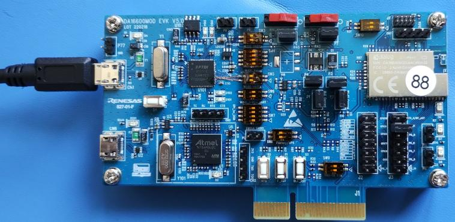
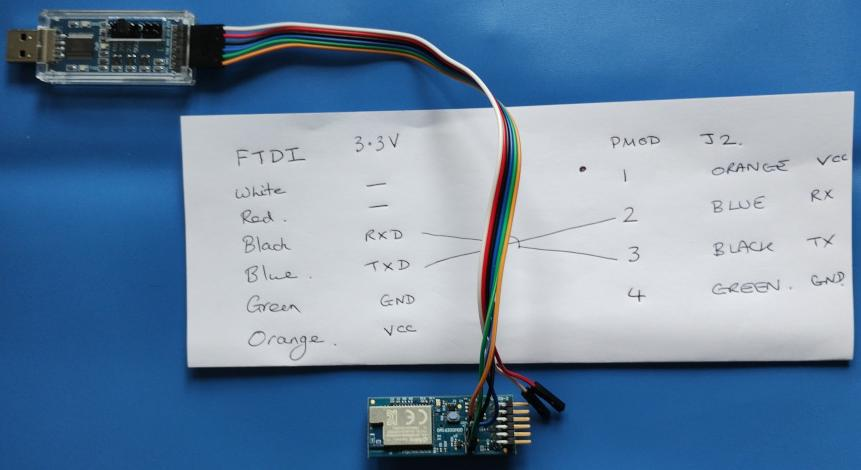
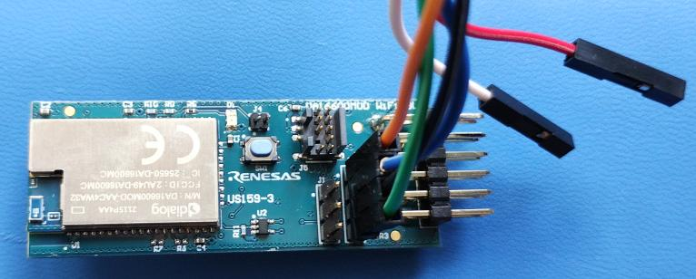

# DA16xxx AT Interface QuickStart Guide

This document will walk through the setup process for the DA16K /IOTCONNECT AT Command Interface Firmware.

<!-- TOC start (generated with https://github.com/derlin/bitdowntoc) -->

   * [Introduction](#introduction)
   * [Revision Info](#revision-info)
   * [Requirements](#requirements)
   * [DA16xxx Hardware](#da16xxx-hardware)
   * [Finding the correct COM port for the command console](#finding-the-correct-com-port-for-the-command-console)
   * [Flashing the /IOTCONNECT DA16K AT Image](#flashing-the-iotconnect-da16k-at-image)
   * [DA16xxx Configuration via the command console](#da16xxx-configuration-via-the-command-console)
   * [Setting up /IOTCONNECT](#setting-up-iotconnect)
   * [Running /IOTCONNECT_client](#running-iotconnect_client)
   * [OTA](#ota)
   * [AT Command Console](#at-command-console)

<!-- TOC end -->

## Introduction

The **Dialog DA16200** and **DA16600** are ultra-low-power Wi-Fi SoCs designed to enable reliable and long-lasting connectivity for battery-powered IoT devices. Both SoCs are optimized for IoT applications, with the **DA16200** providing single-band Wi-Fi connectivity and the **DA16600** integrating both Wi-Fi and Bluetooth Low Energy (BLE) for dual-connectivity use cases. These features make the DA16xxx family ideal for applications like smart home devices, healthcare monitors, industrial IoT, and asset tracking.

This quickstart guide demonstrates how to integrate the DA16200 and DA16600 modules with **/IOTCONNECT**, Avnet’s robust IoT platform. /IOTCONNECT simplifies cloud integration by providing features such as secure device onboarding, real-time telemetry, advanced data visualization, and over-the-air (OTA) updates.

### Communication Flow

The interactions between components are as follows:

**Embedded client** &larr; *Serial/PMOD* &rarr; **DA16xxx** &larr; *WiFi* &rarr; **/IOTCONNECT**

This communication flow highlights the DA16200 and DA16600 acting as the connectivity bridge between the embedded client and the /IOTCONNECT platform. 

### Key Features of the DA16xxx Family
- **Ultra-Low Power Wi-Fi**: Optimized for battery-powered devices, enabling years of operation on standard batteries.
- **Always-On Connectivity**: Maintains a continuous Wi-Fi connection with minimal power consumption.
- **Dual Connectivity (DA16600)**: Combines Wi-Fi and Bluetooth Low Energy for flexible IoT applications.
- **Integrated Security**: Includes hardware-level encryption, secure boot, and other advanced security protocols.
- **IoT-Ready**: Designed to seamlessly integrate with /IOTCONNECT for scalable and reliable cloud connectivity.

### DA16200 PMOD

Below is an example of the DA16200 PMOD, which facilitates easy integration with embedded clients for prototyping and development:


### AT Command Support

The DA16xxx devices use an **AT interface command set** to enable communication and configuration. The supported command set is documented in the [AT Command Set Documentation](AT_COMMAND_SET.md). Developers can use this interface to manage connectivity, data exchange, and device configurations.

This guide will help you quickly set up and connect the DA16200 and DA16600 to /IOTCONNECT, enabling you to leverage their full potential for your IoT applications.


## Revision Info

- View the complete [Commit History](https://github.com/avnet-iotconnect/iotc-dialog-da16k-sdk/commits/main) for this repository.
- View changes to this document: [QUICKSTART.md History](https://github.com/avnet-iotconnect/iotc-dialog-da16k-sdk/commits/main/doc/QUICKSTART.md).

## Requirements

* A computer running an actively supported version of Windows (10 / 11)
* A supported DA16K
* A terminal program, such as TeraTerm or HyperTerminal.
* A USB-to-Serial converter. We recommend the following:
    - [Amazon: DSD TECH SH-U09C5 USB to TTL UART Converter](https://www.amazon.de/-/en/TECH-SH-U09C5-Converter-Cable-Support-Multi-Coloured/dp/B07WX2DSVB)
    - FTDI FT-232H-based
    
      
* Current drivers for the USB-to-Serial converter or EVK
    - For FTDI-based dongles and DA16xxx EVK boards:
    
        FTDI D2XX Drivers [can be obtained here.](https://ftdichip.com/drivers/d2xx-drivers/)
      
        
* Renesas DA16200 DA16600 Multi Downloader Tool
    - Can be obtained at the [Renesas DA16200 Product Page](https://www.renesas.com/us/en/products/wireless-connectivity/wi-fi/low-power-wi-fi/da16200-ultra-low-power-wi-fi-soc-battery-powered-iot-devices#design_development)

        


If you are running Linux, use the **Developers Guide** to set up the firmware and image instead.


## DA16xxx Hardware

The DA16xxx hardware platforms used here broadly speaking provide two usable serial ports for this project:

* The **debug console**
    * Runs at 230400 Baud
    * Used to configure the device and flash the firmware.
* The **AT command interface**
    * Runs at 115200 Baud
    * This is the serial interface that will be used by the embedded client to send data to the DA16k for transmission to /IOTCONNECT.

### Supported Boards

The SDK is intended for and tested with the following platforms:

* EVK Boards
    * DA16200MOD EVK
    * DA16600MOD EVK
* PMOD Dongles
    * DA16200MOD
    * DA16600MOD

You will be guided through the setup process below.

Please refer to the Renesas guide “[User Manual, DA16200 DA16600 FreeRTOS Getting Started Guide, UM-WI-056](LINK_TO_USER_MANUAL)” in case there are changes in the future.

### DA16200MOD / DA16600MOD EVK

|16200MOD EVK|16600MOD EVK|
|-|-|
|  |  |

The EVK boards provide the serial connections using the debug and AT command interfaces.

### DA16200MOD / DA16600MOD PMOD Dongle

|16200MOD|16600MOD|
|-|-|
|  |  |

#### FTDI connection

Connect the PMOD dongle to the FTDI dongle as follows:




|16200MOD|16600MOD|
|-|-|
|  |  |

Note: RX/TX need to be crossed when connecting them, i.e.:

* The USB-Serial dongle's TX line goes to RX on the PMOD.
* The USB-Serial dongle's RX goes to TX on the PMOD.

The USB-Serial dongle, if it allows such setting, should be set to 3.3V operation.

### Device Specification Documentation

For detailed device specifications, including pinouts, electrical characteristics, and design guidelines, refer to the [Device Specification Documentation](LINK_TO_SPECIFICATION).

### Standard Kit Contents

A standard DA16xxx hardware kit typically includes:
1. **DA16xxx Module** (DA16200MOD or DA16600MOD depending on the selected kit).
2. **Evaluation Board** (EVK version only).
3. **Micro-USB Cable** for power and communication.
4. **Quick Start Guide** with setup instructions.

*Note: The specific contents may vary depending on the distributor. Please confirm with your vendor.*

### Additional Components Required

To use the DA16xxx hardware effectively, the user must provide the following:
1. **Host Controller**: An embedded microcontroller or processor capable of interfacing with the DA16xxx via UART (e.g., STM32, Raspberry Pi).
2. **Power Source**: Either through the included Micro-USB cable, the host controller or an external power supply compatible with the board specifications.
3. **PMOD Adapter**: If integrating with an embedded board that does not support the PMOD 3a specification.  Note, (x4) jumber wires will suffice for prototyping.
4. **Debugging Tools**: USB-to-UART adapters (e.g., FTDI-based) for console debugging and flashing firmware.

### Additional Documentation

For more detailed instructions, firmware updates, and design resources, refer to the following:
- [DA16xxx Firmware Update Guide](LINK_TO_FIRMWARE_GUIDE)
- [AT Command Set Documentation](AT_COMMAND_SET.md)
- [/IOTCONNECT SDK User Guide](LINK_TO_SDK_USER_GUIDE)


## Finding the correct COM port for the command console

Both the EVK boards and the PMOD modules will show up as **USB Serial Device** in the device manager:


* On the EVK boards, the **command console** is on the **lower port (at 230400 baud)**. 

    For example, after connecting it and installing the drivers, you should see **two** new *USB Serial Device* entries, such as:

    * USB Serial Device (COM7)
    * USB Serial Device (COM8)

    In this case, the debug console is the **first** entry (COM7).

* On the PMOD modules, connect the device to the USB-Serial dongle as described above.

    The dongle will only add a single new *USB Serial Device* entry, which will then correspond to the debug console.

## Flashing the /IOTCONNECT DA16K AT Image

Before you can use the /IOTCONNECT AT Command functions, you must flash the firmware.

You can either build it yourself (see the [Developers Guide](DEVELOPER_GUIDE.md)) or use the pre-built firmware images in the `/images/` directory at the root of the repository.

This assumes that the device has an intact *BOOT* partition, as it would have from the factory or if another working firmware image was deployed before.

In the unlikely event that your device does *not* have an intact *BOOT* partition, follow the [Developers Guide](DEVELOPER_GUIDE.md) to build and flash one.

To flash the /IOTCONNECT firmware, follow these steps:

* Extract and launch the downloaded Multi Download Tool.
* Click the `Settings` Button.

    

* **In the `Settings` Window:**
    * Click the check-box next to `RTOS1`

    * Add the firmware image by double-clicking the grey field to the right of `RTOS1` and navigating to it.

    * Set the destination address to `0x23000`

    * The window should now look similar to the following graphic:
    
        

* Close the `Settings` window.

* Select the COM port corresponding to the debug console terminal (you may have to experiment to find it) and click **Download**.

    

* The image will now be downloaded on the device.

    

* Once the image is finished, a message indicating the success (or failure) will be displayed.

    

## DA16xxx Configuration via the command console

Before setting upthe /IOTCONNECT specific options, you must set up the device according to the *User Manual DA16200 DA16600 FreeRTOS Getting Started Guide UM-WI-056* from **Renesas**.

Currently the document can be found linked at:
[Renesas DA16200 page](https://www.renesas.com/us/en/products/wireless-connectivity/wi-fi/low-power-wi-fi/da16200mod-devkt-da16200-ultra-low-power-wi-fi-modules-development-kit?gclid=EAIaIQobChMIxKyz4qHcgAMV1oFQBh3eWQsQEAAYASAAEgLqnvD_BwE#document)
or
[Renesas DA16600 page](https://www.renesas.com/eu/en/products/wireless-connectivity/wi-fi/low-power-wi-fi/da16600mod-devkt-da16600-ultra-low-power-wi-fi-bluetooth-low-energy-modules-development-kit#document).


The following is a rough summary of the steps to be taken.

* Connect to the command console (the same COM port used for flashing the firmware) using a serial terminal program of your choice.

    **Note: It is recommended that you disable Flow Control, if your application permits it**.

    After establishing the serial connection, boot the device.


* You should see a command prompt:

<pre><samp>[/DA16200] #</samp></pre>

* Type <kbd>setup</kbd> to:
    - Associate a WiFi access point (SSID, password, etc.)

    - Enable and configure SNTP to start automatically on boot.

    - This setup process will write values to NVRAM that will be used when the DA16200 reboots.

    - The firmware might ask you if you wish to configure DPM.
    
        **At this point in time, DPM modes are unsupported.**

        Therefore, you *must* answer this question with `No`

* The following is an example log of this configuration process:

<pre><samp>
    Wakeup source is 0x0
    [dpm_init_retmemory] DPM INIT CONFIGURATION(1)
    
            ******************************************************
            *             DA16200 SDK Information
            * ---------------------------------------------------
            *
            * - CPU Type        : Cortex-M4 (120MHz)
            (...)
            *
            ******************************************************

    (...)

    [/DA16200] # setup

    Stop all services for the setting.
     Are you sure ? [Yes/No] : y

    [ DA16200 EASY SETUP ]

    Country Code List:
    AD  AE  AF  AI  AL  AM  AR  AS  AT  AU  AW  AZ  BA  BB  BD  BE  BF  BG  BH  BL
    (...)
    UK  US  UY  UZ  VA  VC  VE  VI  VN  VU  WF  WS  YE  YT  ZA  ZW  ALL

     COUNTRY CODE ? [Quit] (Default KR) : DE

    SYSMODE(WLAN MODE) ?
            1. Station
            2. Soft-AP
            3. Station & SOFT-AP
     MODE ?  [1/2/3/Quit] (Default Station) : 1

    [ STATION CONFIGURATION ]
    ============================================================================
    [NO] [SSID]                                         [SIGNAL] [CH] [SECURITY]
    ----------------------------------------------------------------------------
    [ 1] AVNET_TEST                                         -51   1         WPA2
    (...)
    ----------------------------------------------------------------------------
    [M] Manual Input
    [Enter] Rescan
    ============================================================================

     Select SSID ? (1~14/Manual/Quit) : 1

     PSK-KEY(ASCII characters 8~63 or Hexadecimal characters 64) ? [Quit]
    [123456789|123456789|123456789|123456789|123456789|123456789|1234]
    :***********

     Do you want to set advanced WiFi configuration ? [No/Yes/Quit] (Default No) : n

    ============================================
    SSID        : AVNET_TEST
    AUTH        : WPA/WAP2-PSK
    ENCRYPTION  : TKIP/AES(CCMP)
    PSK KEY     : ***********
    KEY TYPE    : ASCII
    PMF MODE    : Disable
    Hidden AP   : Not connect
    ============================================
     WIFI CONFIGURATION CONFIRM ? [Yes/No/Quit] : y

     IP Connection Type ? [Automatic IP/Static IP/Quit] : a

    IP Connection Type: Automatic IP

     IP CONFIGURATION CONFIRM ? [Yes/No/Quit] : y

     SNTP Client enable ? [Yes/No/Quit] : y

     SNTP Period time (1 ~ 36 hours) ? (default : 36 hours) [Quit]

     GMT Timezone +xx:xx|-xx:xx (-12:00 ~ +12:00) ? (default : 00:00) [Quit]

     SNTP Server 0 addr ? (default : pool.ntp.org) [Quit]
     SNTP Server 1 addr ? (default : 1.pool.ntp.org) [Quit]
     SNTP Server 2 addr ? (default : 2.pool.ntp.org) [Quit]
  
    ============================================
    SNTP Client      : Enable
    SNTP Period time : 36 hours
    SNTP GMT Timezone: 00:00
    SNTP Server addr : pool.ntp.org
    SNTP Server addr1: 1.pool.ntp.org
    SNTP Server addr2: 2.pool.ntp.org
    ============================================
     SNTP Client CONFIRM ? [Yes/No/Quit] : y

     Fast Connection Sleep 2 Mode ? [Yes/No/Quit] : y

    Configuration OK

    Reboot...


    Wakeup source is 0x0
    [dpm_init_retmemory] DPM INIT CONFIGURATION(1)


            ******************************************************
            *             DA16200 SDK Information
            * ---------------------------------------------------
            *
            * - CPU Type        : Cortex-M4 (120MHz)
            (...)
            *
            ******************************************************


    >>> Wi-Fi Fast_Connection mode ...


    System Mode : Station Only (0)
    >>> Start DA16X Supplicant ...
    >>> DA16x Supp Ver2.7 - 2022_03
    (...)
    -- DHCP Client WLAN0: BOUND(10)
             Assigned addr   : 192.168.0.12
                   netmask   : 255.255.255.0
                   gateway   : 192.168.0.1
                   DNS addr  : 192.168.0.1

             DHCP Server IP  : 192.168.0.1
             Lease Time      : 24h 00m 00s
             Renewal Time    : 12h 00m 00s
</samp></pre>

> [!NOTE]
> 
> ***[/DA16200/NVRAM]clearenv*** This command can erase all the settings in NVRAM and you can re-write settings again.

## Setting up /IOTCONNECT

### Configuring Certificates & /IOTCONNECT Application Config

Refer to the [Application Setup Guide](SETUP_APP.md).

***NOTE***: It is impossible for the  DA16xxx to process multiple possible certificates for a Root CA – all testing has used a single certificate. Obviously, if a certificate doesn’t allow a connection, then it may be required to manually swap to an alternative certificate.

## Running iotconnect_client

### Setup - read IOTC values from NVRAM

Ensure all certificates are in place, and that iotconnect_config has been used to save the configuration -- before initiating `iotconnect_client setup`.

If the configuration stage is missed, then there will be no valid values to setup.

To setup /IOTCONNECT values, run:
`
```
iotconnect_client setup
```

### Start (Discovery/Sync & MQTT Setup)

Ensure that all certificates are in place, that iotconnect_config has been used to save the configuration, and that "iotconnect_client setup" has been run -- before initiating "iotconnect_client start".

To run /IOTCONNECT discovery/sync and update MQTT values and start mqtt_client, run
```
iotconnect_client start
```
Check that the device is shown as connected on the /IOTCONNECT dashboard.

Note: must have been setup before starting.

### Stop

To disconnect from /IOTCONNECT but leave the runtime configuration intact
```
iotconnect_client stop
```
Check that the device is shown as disconnected on the /IOTCONNECT dashboard.

**Note:** After stopping, there is no necessitgy to perform another setup before the next start. The previously determined values will be re-used.

### Reset

To disconnect from /IOTCONNECT and **reset the entire runtime configuration**, run:

```
iotconnect_client reset
```
Check that the device is shown as disconnected on the /IOTCONNECT dashboard.

**Note:** After resetting, another setup *must* be performed before the next start.

### Message

To send an /IOTCONNECT message with up to **7** key/value pairs, run

```
iotconnect_client msg [name1] [value1] [name2] [value2] (...)
```

Verify in the dashboard that the device is shown as connected and that the message data can be seen.

### Commands

Commands are automatically acknowledged and stored in a queue upon reception. They must be fetched using an AT Command and processed by the connected device.

## OTA

**OTA is not yet supported.**

## AT Command Console

You may now wish to access the AT Command serial interface (for example, to send out telemetry).

Continue with the [AT Console documentation](AT_COMMAND_SET.md) to access and use it.

